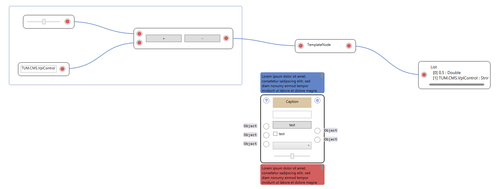

# TUM.CMS.VplControl 0.3#
**TUM.CMS.VplControl** is a WPF based Visual Programming Control for .Net.

----------

----------

----------

----------

### Get Started ###

Download or clone this repository and run the test project in visual studio.

Give it a try:

- Add node (`double click`)
- Context menu (`right click`)

- Group selected nodes (`Ctrl+G`)
- Select all nodes (`Ctrl+A`)
- Copy nodes to clipboard (`Ctrl+C`)
- Insert nodes from clipboard (`Ctrl+V`)
- Open from .xml file (`Ctrl+O`)
- Save to .xml file (`Ctrl+S`)
- Delete nodes (`DEL`)

### Features ###
- Drawing nodes
- Customize nodes
- Resizeable nodes
- Panning
- Grouping
- Hints
- Copy/Paste
- Serialize/Deserialize
- Zooming
- Type sensetive
- Customizable style
- Vertical/Horizontal flow switch
- ZoomToFit
- Aligning
- Radial context menu

### ToDo ###
- Lacing
- Animations
- Resize group node to one node
- Nodes for graph plotting / sql
- Drag&Drop nodes from toolbox
- Performance improvement: Virtual canvas
- Better zooming
- Node preview at port
- Calculation progress bar
- Connector remove

----------

### Using TUM.CMS.VplControl in your project ###

- Start a new WPF project

- Add reference to **TUM.CMS.VplControl.dll**

- Add a ResourceDictionary to your App.xaml file

    	<Application x:Class="KBEControlCenter2.App"
	     	xmlns="http://schemas.microsoft.com/winfx/2006/xaml/presentation"
	     	xmlns:x="http://schemas.microsoft.com/winfx/2006/xaml"
	     	StartupUri="MainWindow.xaml">
	    
	    	<Application.Resources>
	    	
	    		<ResourceDictionary>
	    			<ResourceDictionary.MergedDictionaries>
	    				<ResourceDictionary Source="/TUM.CMS.VplControl;component/Themes/Generic.xaml" />
	    			</ResourceDictionary.MergedDictionaries>
	    		</ResourceDictionary>
	    	
	    	</Application.Resources>
	    </Application>

- Add a VplControl element to your host control:

	    <Window
		    xmlns="http://schemas.microsoft.com/winfx/2006/xaml/presentation"
		    xmlns:x="http://schemas.microsoft.com/winfx/2006/xaml"
		    xmlns:VplControl="clr-namespace:TUM.CMS.VplControl;assembly=TUM.CMS.VplControl"
		    x:Class="TUM.CMS.VplControl.Test.MainWindow"
		    Title="MainWindow" WindowStartupLocation="CenterScreen" WindowState="Maximized">
		
			    <Grid>
			    	<VplControl:VplControl Name="VplControl" />
			    </Grid>
	
	    </Window>

- Route key events of your host Control/Window to the VplControl

        KeyDown += VplControl.VplControl_KeyDown;
        KeyUp += VplControl.VplControl_KeyUp;

----------

###Create custom nodes###

You find a TemplateNode.cs file in the test project:

    using System.Windows.Controls;
    using TUM.CMS.VplControl.Nodes;
    
    namespace TUM.CMS.VplControl.Test.Nodes
    {
	    public class TemplateNode : Node
	    {
		    public TemplateNode(VplControl hostCanvas)
			    : base(hostCanvas)
		    {
			    AddInputPortToNode("Test", typeof (object));
			    AddOutputPortToNode("Test", typeof (object));
			    
			    AddControlToNode(new Label {Content = "TemplateNode"});
		    }
			    
		    public override void Calculate()
		    {
		    	OutputPorts[0].Data = InputPorts[0].Data;
		    }
			    
	        public override void SerializeNetwork(XmlWriter xmlWriter)
	        {
	            base.SerializeNetwork(xmlWriter);
	
	            // add your xml serialization methods here
	        }
	
	        public override void DeserializeNetwork(XmlReader xmlReader)
	        {
	            base.DeserializeNetwork(xmlReader);
	
	            // add your xml deserialization methods here
	        }

		    public override Node Clone()
		    {
		    	return new TemplateNode(HostCanvas)
			    {
			    Top = Top,
			    Left = Left
			    };
		    }
	    }
    }

This TemplateNode consists of a Input- and OutputPort and a label. Use the Calculate() method to implement your tasks.

Add your custom nodes to the ExternalNodeTypes Property of the VplControl and set the NodeTypeMode to All or OnlyExternal:

    VplControl.ExternalNodeTypes.AddRange(
        ClassUtility.GetTypesInNamespace(Assembly.GetExecutingAssembly(), "TUM.CMS.VplControl.Test.Nodes")
            .ToList());

    VplControl.NodeTypeMode = NodeTypeModes.All;

----------

### Contact ###
Dominic Singer

dominic.singer@tum.de

11th August 2015